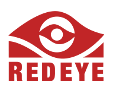

# RedEye iOS Bootcamp

Hey there bootcamper, welcome to the RedEye iOS Bootcamp! In this bootcamp, you'll learn the basics of building an iOS app and we'll introduce you to where you can go from here.

## Join the #conversation

We're on Brisbane Slack on the channel #ios-bootcamp - you should join below so we can talk all things bootcamp!

[Join Brisbane Slack](https://brisbane.herokuapp.com/)

## Sessions

### 9:30 - 12noon - Session 1: Hello World

* Create an Xcode Project
* Understand the Xcode interface
* Check out some Swift
* Understand how Swift came about

[Go to the tutorial](https://github.com/redeyeapps/ios-bootcamp/blob/master/make-an-app-session-1.md)

### 1 - 3pm - Session 2:

[Go to the tutorial](https://github.com/redeyeapps/ios-bootcamp/blob/master/make-an-app-session-2.md)

### 3 - 5pm - Session 3:

[Go to the tutorial](https://github.com/redeyeapps/ios-bootcamp/blob/master/make-an-app-session-3.md)

* Things
* Stuff

## What next?

Join our Slack channel and jump into **#cocoaheads** which is the name of the Brisbane iOS & Mac Developers. If you've got those situations where you just can't work something out, pop in and ask for help!

**Come along to the next CocoaHeads Brisbane Meetup is Tuesday 9 May 2017**

RSVP via Meetup.com, free event including pizza and drinks; [https://www.meetup.com/en-AU/cocoaheads/events/238997201/](https://www.meetup.com/en-AU/cocoaheads/events/238997201/)